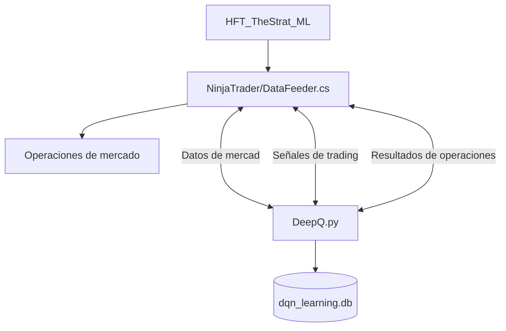
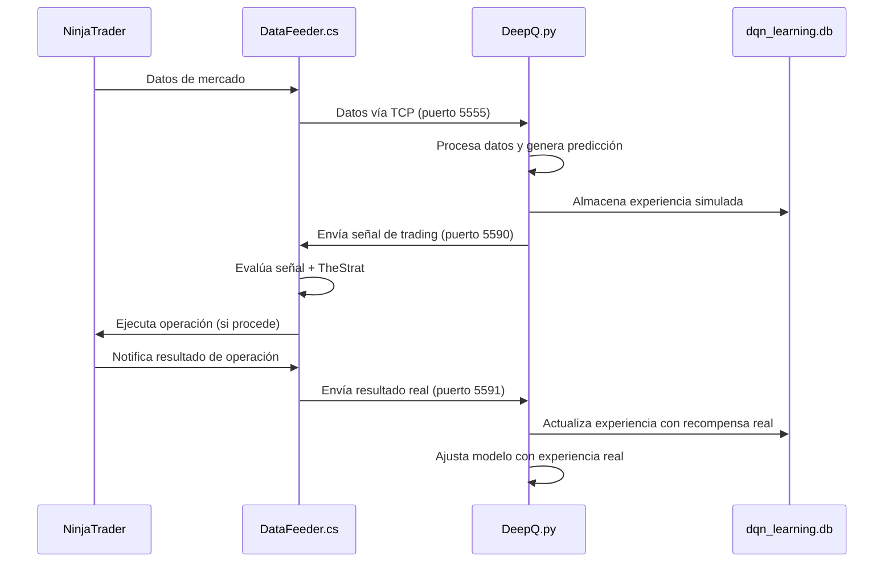

# 🚀 DeepQLearning para Trading Algorítmico 📈


## 🌟 Visión General

DeepQLearning es un sistema avanzado de trading algorítmico que combina aprendizaje por refuerzo profundo con la plataforma NinjaTrader 8. El sistema utiliza datos de mercado en tiempo real para generar señales de trading, las ejecuta automáticamente y aprende de los resultados reales para mejorar continuamente.



## 🧠 Características Principales

- 🤖 **Aprendizaje por Refuerzo Profundo**: Utiliza Stable-Baselines3 con el algoritmo PPO
- 🔄 **Retroalimentación Bidireccional**: Integración completa entre Python y NinjaTrader
- 💡 **Sistema de Consenso**: Combina múltiples fuentes de señales para reducir falsos positivos
- 📊 **Adaptación Continua**: Aprende y mejora con cada operación realizada
- 🛡️ **Gestión de Riesgo Integrada**: Utiliza estrategias ATM de NinjaTrader para control profesional del riesgo
- 📚 **Persistencia de Conocimiento**: Almacena experiencias en SQLite para aprendizaje a largo plazo

## 📋 Componentes del Sistema

### 🐍 DeepQ.py

El cerebro del sistema. Implementa un agente de aprendizaje por refuerzo que:

- Recibe datos de mercado vía TCP
- Procesa los datos usando técnicas de ventana móvil
- Genera señales de trading con niveles de confianza
- Almacena experiencias en la base de datos
- Aprende de los resultados reales de las operaciones

### 📊 DataFeeder.cs

Una estrategia para NinjaTrader 8 que:

- Envía datos de mercado a DeepQ.py
- Recibe y evalúa señales de trading
- Implementa un sistema de votación con el indicador HFT_TheStrat_ML
- Ejecuta operaciones usando estrategias ATM nativas
- Envía resultados de operaciones de vuelta a DeepQ.py

### 🧪 Sistema de Recompensas Híbrido

Un enfoque innovador que:

- Comienza con recompensas simuladas basadas en movimientos de precio
- Gradualmente incorpora recompensas reales basadas en P&L
- Utiliza un factor de ponderación adaptativo (alpha) que evoluciona con el tiempo
- Normaliza las ganancias/pérdidas a un rango consistente de recompensas

## 🛠️ Instalación y Configuración

### Requisitos Previos

- Python 3.9 o superior
- NinjaTrader 8
- Dependencias Python (ver `requirements.txt`)

### Configuración de NinjaTrader

1. **Preparar Plantillas ATM**:
   - Crea dos plantillas: "ATM-LONG" y "ATM-SHORT" en NinjaTrader
   - Configura niveles apropiados de stop loss y take profit

2. **Importar Componentes**:
   - Descomprime e importa `NT8/ML_Predator.zip` (indicador)
   - Descomprime e importa `NT8/DataFeeder.zip` (estrategia)
   - Compila los NinjaScripts (Build > Compile)

3. **Configurar DataFeeder**:
   - Aplica la estrategia a un gráfico del instrumento deseado
   - Configura parámetros:
     - `DefaultQuantity`: Cantidad de contratos
     - `MaxDailyTrades`: Límite diario de operaciones
     - `RequireConsensus`: Preferiblemente "true"
     - `MinConfidenceThreshold`: Entre 0.6-0.7

### Instalación de Python

```bash
# Instalar dependencias
pip install -r requirements.txt
```

## 🚀 Ejecución del Sistema

1. **Iniciar NinjaTrader y DataFeeder**:
   - Abre NinjaTrader y asegúrate que DataFeeder esté activo
   - Verifica que las plantillas ATM estén configuradas

2. **Ejecutar DeepQ.py**:
   ```bash
   python DeepQ.py
   ```
   - Configura el tamaño de la ventana de lag si es necesario
   - Espera a que se acumulen suficientes datos

3. **Monitoreo**:
   - Observa la consola de Python para ver señales emitidas
   - Verifica la pestaña "Output" en NinjaTrader para confirmación de operaciones
   - Supervisa el rendimiento en el gráfico de NinjaTrader

## 📊 Flujo del Sistema



## 📝 Notas importantes

- **Entrenamiento**: La base de datos `dqn_learning.db` almacena todas las experiencias y es persistente entre sesiones. No la elimines para conservar el conocimiento adquirido.
- **Recolección de Datos**: Al inicio de cada sesión, el sistema necesita acumular suficientes datos (por defecto 3000 puntos) antes de comenzar a generar señales.
- **Modo Playback**: El entrenamiento puede realizarse en modo playback de NinjaTrader para acumular experiencias sin riesgo real.
- **Intervalo entre Operaciones**: El sistema espera un mínimo de 2 minutos entre operaciones para evitar sobretrading.
- **Límite Diario**: Respeta el número máximo de operaciones diarias configurado para gestionar el riesgo.

## 🔧 Posibles Mejoras

- Implementar guardado/carga de modelos entrenados
- Añadir soporte para múltiples instrumentos simultáneos
- Implementar un panel de visualización en tiempo real
- Añadir notificaciones por correo electrónico o SMS
- Incorporar análisis de sentimiento de mercado

---

⚠️ **Aviso de Riesgo**: El trading algorítmico conlleva riesgos significativos. Este sistema debe ser utilizado con comprensión completa de las operaciones que realiza y con capital que pueda permitirse perder. Pruebe exhaustivamente en entornos simulados antes de utilizar con dinero real.
